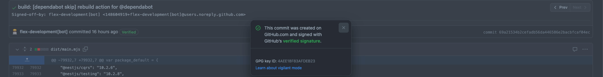

# :white_check_mark: gh-commit

[](https://github.com/flex-development/gh-commit/releases/latest)
[](https://github.com/marketplace/actions/gh-commit)
[](https://codecov.io/gh/flex-development/gh-commit)
[](https://github.com/voxpelli/badges-cjs-esm)
[](https://github.com/sponsors/flex-development)
[](LICENSE.md)
[](https://conventionalcommits.org/)
[](https://typescriptlang.org/)
[](https://vitest.dev/)
[](https://yarnpkg.com/)

Create commits with the [GitHub API][1]

## Contents

- [What is this?](#what-is-this)
- [Use](#use)
  - [Example Workflow](#example-workflow)
  - [Inputs](#inputs)
    - [`api`](#api)
    - [`files`](#files)
    - [`message`](#message)
    - [`owner`](#owner)
    - [`ref`](#ref)
    - [`repo`](#repo)
    - [`token`](#token)
      - [Required Permissions](#required-permissions)
    - [`trailers`](#trailers)
    - [`workspace`](#workspace)
  - [Outputs](#outputs)
    - [`sha`](#sha)

## What is this?

Create commits with GitHub Actions via the [GitHub GraphQL API][1].

Commits made using this action are automatically signed by GitHub if supported and marked as verified in the user
interface.



## Use

### Example Workflow

```yaml
# Release Chore
#
# Execute branch, version bump, changelog, and pull request operations on release chore commit.
#
# References:
#
# - https://docs.github.com/actions/learn-github-actions/contexts
# - https://docs.github.com/actions/learn-github-actions/expressions
# - https://docs.github.com/actions/using-workflows/events-that-trigger-workflows#push
# - https://docs.github.com/actions/using-workflows/using-github-cli-in-workflows
# - https://docs.github.com/actions/using-workflows/workflow-commands-for-github-actions
# - https://docs.github.com/webhooks-and-events/webhooks/webhook-events-and-payloads#push
# - https://github.com/actions/checkout
# - https://github.com/actions/create-github-app-token
# - https://github.com/actions/github-script
# - https://github.com/flex-development/grease
# - https://github.com/hmarr/debug-action
# - https://github.com/kaisugi/action-regex-match
# - https://regex101.com/r/OwpOr2
# - https://regex101.com/r/VIIVGd

---
name: release-chore
on:
  push:
    branches:
      - main
concurrency:
  cancel-in-progress: true
  group: ${{ github.workflow }}-${{ github.ref }}
jobs:
  preflight:
    if: startsWith(github.event.head_commit.message, 'release(chore):')
    runs-on: ubuntu-latest
    outputs:
      branch: ${{ steps.branch.outputs.result }}
      message: ${{ steps.message.outputs.result }}
      tag: ${{ steps.tag.outputs.result }}
      version: ${{ steps.version.outputs.match }}
    steps:
      - id: debug
        name: Print environment variables and event payload
        uses: hmarr/debug-action@v2.1.0
      - id: fail-actor
        if: contains(vars.MAINTAINERS, github.actor) == false
        name: Fail on unauthorized actor
        run: |
          echo '**Unauthorized actor: ${{ github.actor }}**' >>$GITHUB_STEP_SUMMARY
          exit 1
      - id: checkout
        name: Checkout ${{ github.ref_name }}
        uses: actions/checkout@v4.1.1
        with:
          persist-credentials: false
          ref: ${{ github.ref }}
      - id: version
        name: Get release version
        uses: kaisugi/action-regex-match@v1.0.0
        with:
          regex: ${{ vars.RELEASE_CHORE_REGEX }}
          text: ${{ github.event.head_commit.message }}
      - id: fail-version
        if: steps.version.outputs.match == ''
        name: Fail on invalid release version
        run: |
          ERR='**Invalid release chore commit: `${{ github.event.head_commit.message }}`**
          Message must match [`${{ vars.RELEASE_CHORE_REGEX }}`](https://regex101.com/r/OwpOr2)'
          echo "$ERR" >>$GITHUB_STEP_SUMMARY
          exit 1
      - id: tag
        name: Get release tag
        run: |
          echo "result=$(jq .tagprefix grease.config.json -r)${{ steps.version.outputs.match }}" >>$GITHUB_OUTPUT
      - id: message
        name: Get release message
        run: 'echo "result=release: ${{ steps.tag.outputs.result }}" >>$GITHUB_OUTPUT'
      - id: branch
        name: Get release branch name
        run: echo "result=release/${{ steps.version.outputs.match }}" >>$GITHUB_OUTPUT
  branch:
    needs: preflight
    runs-on: ubuntu-latest
    steps:
      - id: bot-token
        name: Get bot token
        uses: actions/create-github-app-token@v1.5.1
        with:
          app-id: ${{ secrets.BOT_APP_ID }}
          private-key: ${{ secrets.BOT_PRIVATE_KEY }}
      - id: checkout
        name: Checkout ${{ github.ref_name }}
        uses: actions/checkout@v4.1.1
        with:
          ref: ${{ github.ref }}
          token: ${{ steps.bot-token.outputs.token }}
      - id: branch
        name: Create and push branch ${{ needs.preflight.outputs.branch }}
        run: |
          git branch ${{ needs.preflight.outputs.branch }}
          git push origin --no-verify ${{ needs.preflight.outputs.branch }}
  prepare:
    needs:
      - branch
      - preflight
    permissions:
      packages: read
    runs-on: ubuntu-latest
    env:
      GITHUB_TOKEN: ${{ secrets.GITHUB_TOKEN }}
    steps:
      - id: bot-token
        name: Get bot token
        uses: actions/create-github-app-token@v1.5.1
        with:
          app-id: ${{ secrets.BOT_APP_ID }}
          private-key: ${{ secrets.BOT_PRIVATE_KEY }}
      - id: checkout
        name: Checkout ${{ needs.preflight.outputs.branch }}
        uses: actions/checkout@v4.1.1
        with:
          fetch-depth: 0
          persist-credentials: false
          ref: ${{ needs.preflight.outputs.branch }}
          token: ${{ steps.bot-token.outputs.token }}
      - id: yarn
        name: Install dependencies
        env:
          HUSKY: 0
        run: yarn && echo "$GITHUB_WORKSPACE/node_modules/.bin" >>$GITHUB_PATH
      - id: build
        name: Build project
        env:
          NODE_NO_WARNINGS: 1
        run: yarn build
      - id: bump-manifest
        name: Bump manifest version to ${{ needs.preflight.outputs.version }}
        run: grease bump -w ${{ needs.preflight.outputs.version }}
      - id: bump-readme
        name: Bump README version to ${{ needs.preflight.outputs.version }}
        uses: actions/github-script@v6.4.1
        with:
          github-token: ${{ steps.bot-token.outputs.token }}
          script: |
            const fs = require('fs')

            const path = 'README.md'
            const regex = new RegExp('${{ vars.README_ACTION_VERSION_REGEX }}')

            let content = fs.readFileSync(path, 'utf8')
            content = content.replace(regex, '${{ needs.preflight.outputs.version }}')

            fs.writeFileSync(path, content)
            process.stdout.write(content)
      - id: changelog
        name: Add CHANGELOG entry for ${{ needs.preflight.outputs.tag }}
        env:
          TZ: ${{ vars.TZ }}
        run: |
          echo "$(grease changelog)" >>$GITHUB_STEP_SUMMARY
          grease changelog -sw
      - id: commit
        name: Commit and push release preparation
        uses: flex-development/gh-commit@0.0.0
        with:
          message: ${{ needs.preflight.outputs.message }}
          ref: ${{ needs.preflight.outputs.branch }}
          token: ${{ steps.bot-token.outputs.token }}
          trailers: 'Signed-off-by: ${{ vars.BOT_NAME }} <${{ vars.BOT_EMAIL }}>'
      - id: commit-url
        name: Print commit url
        run: echo ${{ format('{0}/{1}/commit/{2}', github.server_url, github.repository, steps.commit.outputs.sha) }}
```

> See [`release-chore.yml`](.github/workflows/release-chore.yml) for a more robust example.

### Inputs

#### `api`

> default: `${{ github.api_url }}`\
> required: `false`

Base URL of GitHub API.

#### `files`

> required: `false`

Newline-delimited list of changed file filters.

Each filter should be a file path relative to [`workspace`](#workspace).

All detected changes will be committed if file filters are not provided.

Files will be checked against `git status --porcelain --untracked-files`.

#### `message`

> required: `true`

Commit header and body without trailers.

#### `owner`

> default: `${{ github.repository_owner }}`\
> required: `false`

Repository owner.

#### `ref`

> default: `${{ github.event.workflow_run.head_branch || github.head_ref || github.ref }}`\
> required: `false`

Name of branch to push commit to.

#### `repo`

> default: `${{ github.event.repository.name }}`\
> required: `false`

Repository name.

#### `token`

> default: `${{ github.token }}`\
> required: `false`

Personal access token (PAT) used to authenticate GitHub API requests.

##### [Required Permissions][2]

- `contents:write`

#### `trailers`

> required: `false`

Newline-delimited list of git trailers.

#### `workspace`

> default: `${{ github.workspace }}`\
> required: `false`

Path to current working directory.

### Outputs

#### `sha`

SHA of created commit, or an empty string if a commit was not created.

[1]: https://docs.github.com/graphql/reference/mutations#createcommitonbranch
[2]: https://docs.github.com/actions/using-jobs/assigning-permissions-to-jobs
